<h1 align="center">Marvel App</h1>

<p align="center">
  Um gibi interativo da Marvel no seu bolso: descubra personagens, colecione figurinhas<br/>
  e lute com os heróis do seu álbum. Feito para o <b>Marvel API Challenge</b>.
</p>

<p align="center">
  
  
  
  
  
  
  
</p>

<table align="center">
  <tr>
    <td align="center">
      <a href="docs/media/marvel-app-tour.mp4">
        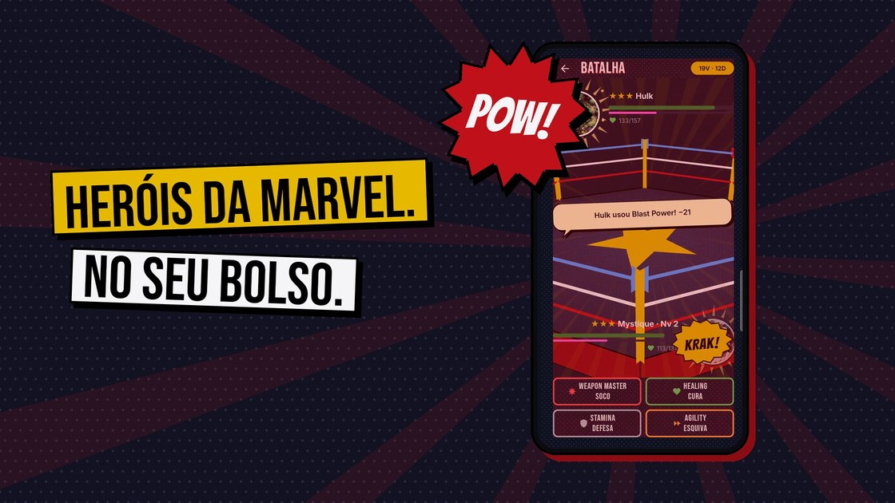
      </a>
      <br/><sub>▶ Tour completo (1min50) — clique para assistir</sub>
    </td>
    <td align="center">
      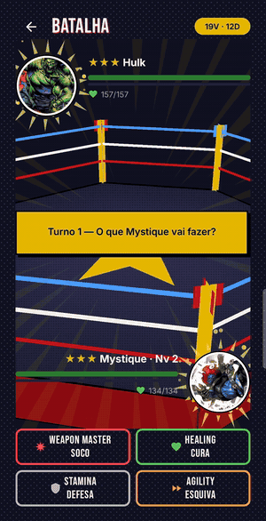
      <br/><sub>Batalha no ringue 3D</sub>
    </td>
  </tr>
</table>

## Sobre

O app consome a [Comic Vine API](https://comicvine.gamespot.com/api/) e transforma os dados reais dos
personagens em jogo: os atributos de combate, os golpes e a raridade de cada figurinha são
**derivados** de poderes, aparições e fama de verdade, nada é inventado. Tudo com cara de
história em quadrinhos: painéis com contorno de nanquim, balões, explosões e onomatopeias, em tema
**claro** ("papel de gibi") e **escuro**.

Kotlin puro, UI 100% em Views + XML + ViewBinding (**sem Compose**), single-Activity com Navigation
Component e MVVM.

## Funcionalidades

**Descobrir**
- Personagens (filtro por origem), times, criadores, filmes e lugares, com busca e paginação.
- Lugares reais abrem no app de mapas; os fictícios mostram a ficha do local.
- Detalhe do personagem com aparições, poderes, times, criadores, filmes e uma **linha do tempo**
  (estreia, times e mortes) montada a partir das edições.
- **Comparar** dois personagens: atributos lado a lado, poderes e times em comum.
- **Foto com o herói**: tire uma foto (ou escolha da galeria) e arraste o personagem para a cena.

**Álbum de figurinhas**
- Pacotes Básico (grátis por dia), Prata (vitória) e Ouro (fechar trilha ou vencer o 3×3).
- Raridade pela fama do personagem: **bronze ★**, **prata ★★** e **ouro ★★★**, e a carta **Divina ✦**
  (+5 em tudo e começa a luta com meia ultimate).
- Carta em 3D com aura de partículas e raios que muda por raridade; repetidas sobem o nível e cada nível
  dá pontos para distribuir nos atributos.

**Batalha**
- 1×1, time 3×3 e 2 jogadores no mesmo aparelho; só luta quem você tem no álbum.
- Ringue em **OpenGL ES 2.0** (sem biblioteca 3D), tela de VS, ultimate, golpes críticos, veneno, cura,
  defesa e esquiva, e troféu 3D na vitória.
- **Trilha do dia**: um time por dia para vencer membro a membro, até o chefe.

**Jogos e IA**
- **Geek**: um agente com Gemini (function calling) que consulta a Comic Vine antes de responder.
- **Quem é esse herói?**, **Que herói é você?** (quiz) e **Com qual herói você parece?** (a foto vai só na
  requisição da IA).

**Início, perfil e extras**
- Herói do dia com os filmes dele, missões diárias e semanais que pagam pacotes, trilha, leituras e resenhas.
- Perfil com conquistas, estante de HQs e filmes (nota e resenha), favoritos e troca de tema.
- Widget e notificação do **Herói do dia**.

## Telas

<table align="center">
  <tr>
    <td align="center">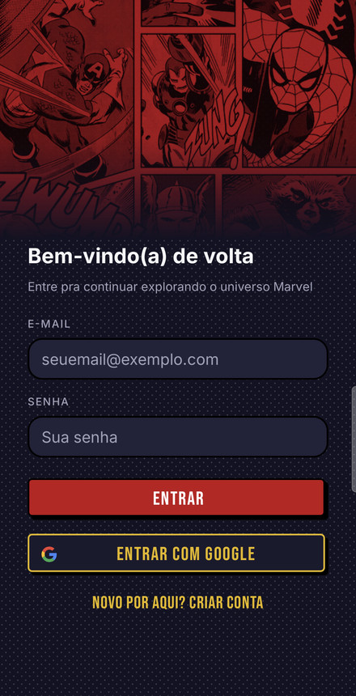<br/><sub>Login</sub></td>
    <td align="center">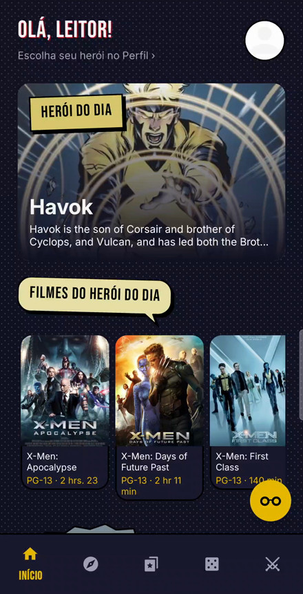<br/><sub>Início</sub></td>
    <td align="center">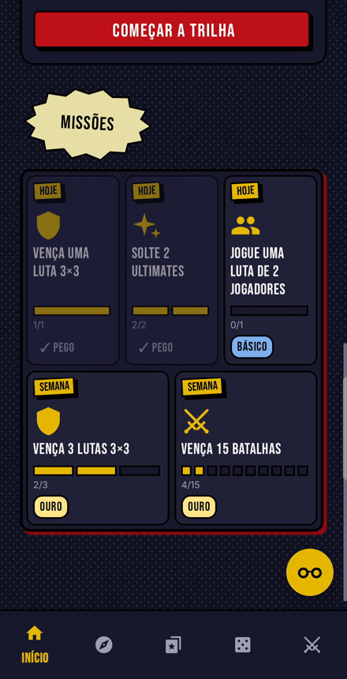<br/><sub>Missões</sub></td>
    <td align="center">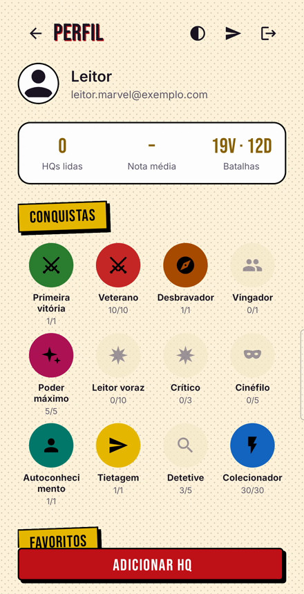<br/><sub>Perfil no tema claro</sub></td>
  </tr>
  <tr>
    <td align="center">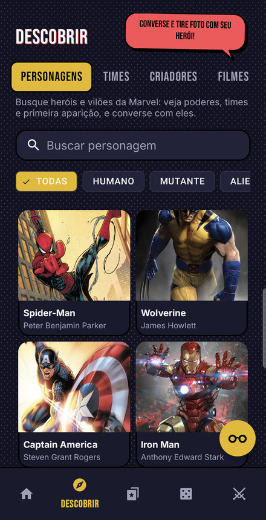<br/><sub>Descobrir</sub></td>
    <td align="center">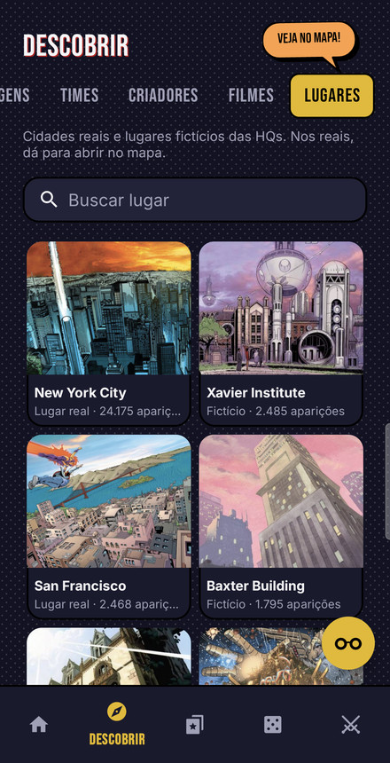<br/><sub>Lugares</sub></td>
    <td align="center">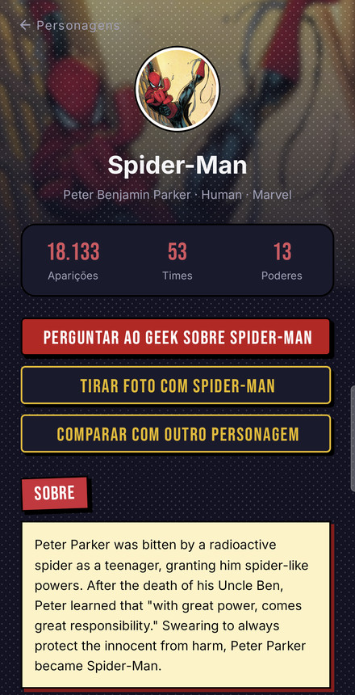<br/><sub>Detalhe</sub></td>
    <td align="center">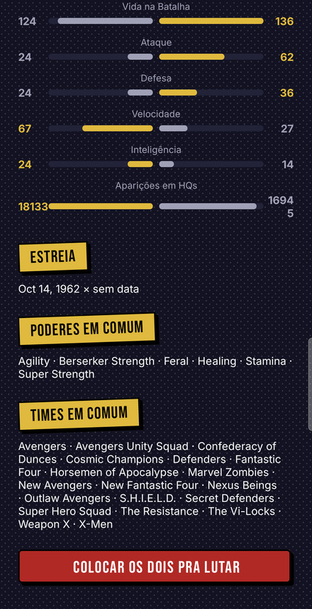<br/><sub>Comparar</sub></td>
  </tr>
  <tr>
    <td align="center">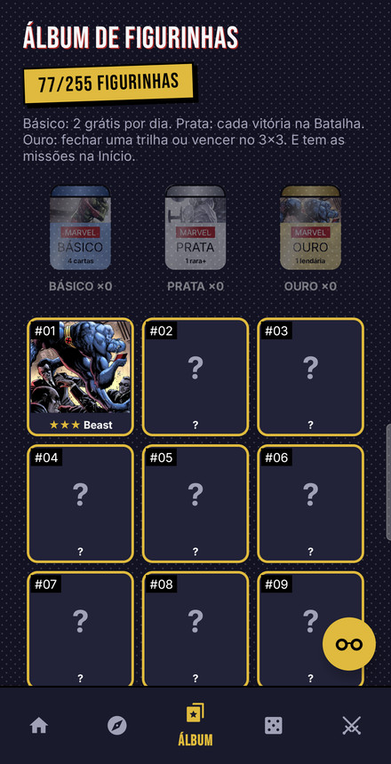<br/><sub>Álbum</sub></td>
    <td align="center">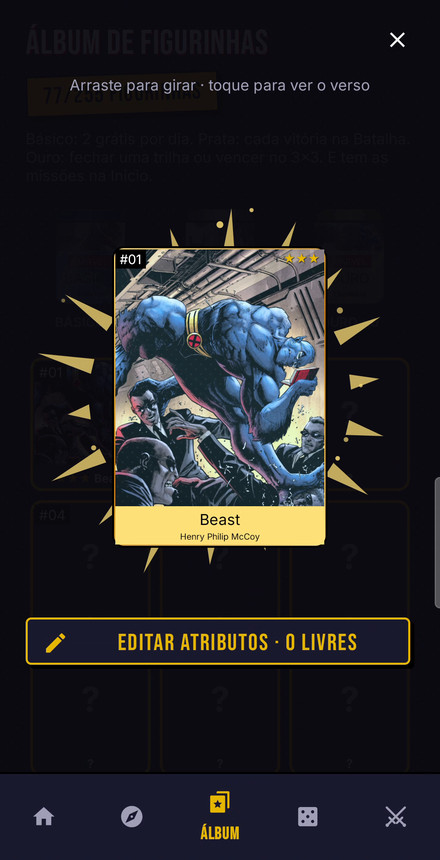<br/><sub>Carta em 3D com aura</sub></td>
    <td align="center">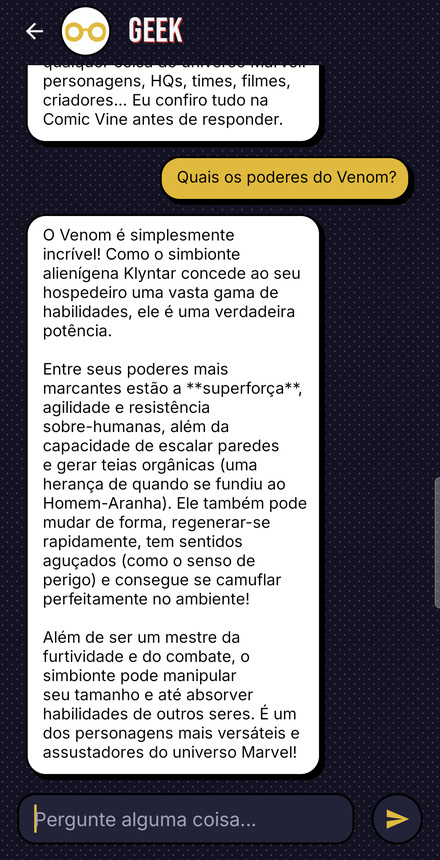<br/><sub>Geek (IA)</sub></td>
    <td align="center">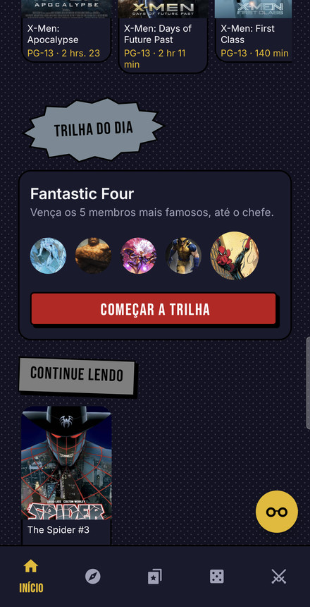<br/><sub>Trilha do dia</sub></td>
  </tr>
  <tr>
    <td align="center">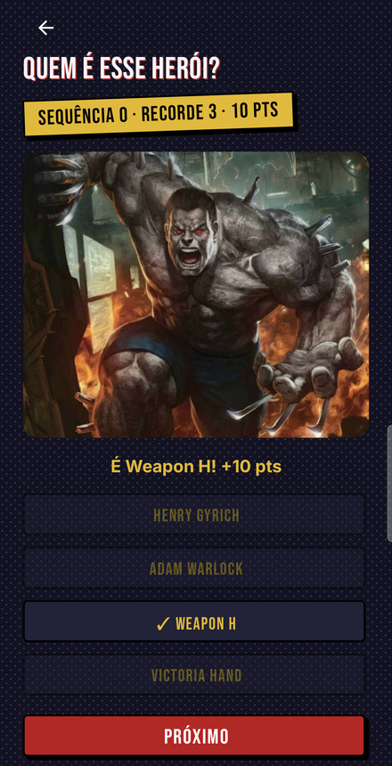<br/><sub>Quem é esse herói?</sub></td>
    <td align="center">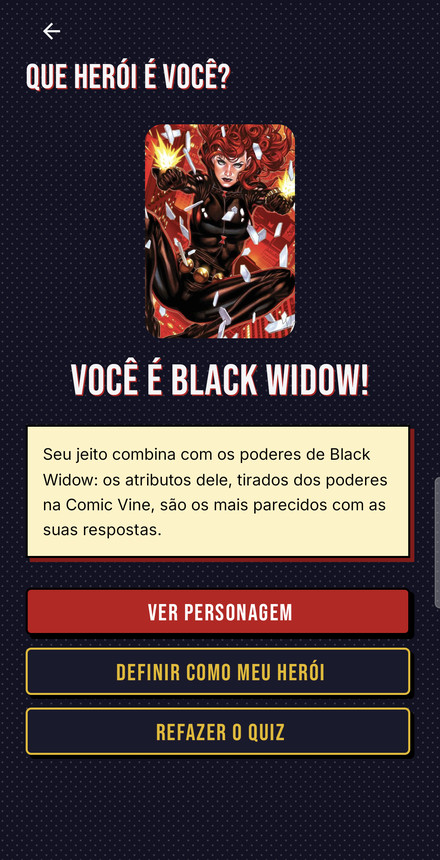<br/><sub>Que herói é você?</sub></td>
    <td align="center">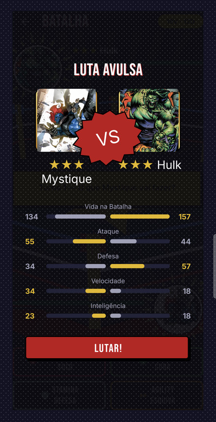<br/><sub>VS</sub></td>
    <td align="center">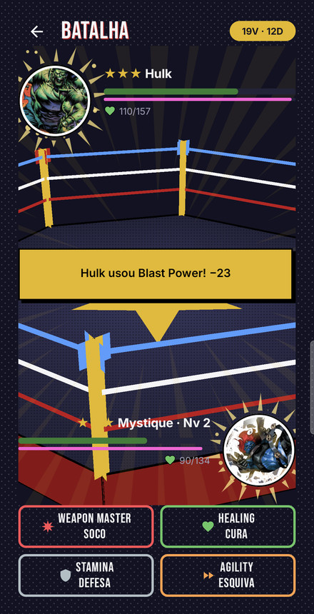<br/><sub>Batalha</sub></td>
  </tr>
</table>

## Design

Segue o design system de [`docs/design-reference/`](docs/design-reference/) (Bebas Neue + Inter) com uma
camada de **tema de HQ** por cima:

- fundo com retícula, painéis com contorno de nanquim, botões com sombra dura e títulos de seção em
  caixas de legenda, balões e explosões;
- na Batalha, movimento em degraus a 24 quadros/s (ar de flipbook), onomatopeias em Bangers
  ("POW!", "K.O.!"), linhas de ação e tremor de tela;
- **tema claro e escuro**: segue o sistema ou o que for fixado no Perfil; os tokens de cor ficam em
  `values/colors.xml` (claro) e `values-night/colors.xml` (escuro), documentados em
  [`DESIGN_TOKENS.md`](docs/design-reference/DESIGN_TOKENS.md).

As animações respeitam a opção do sistema de remover animações.

## Arquitetura

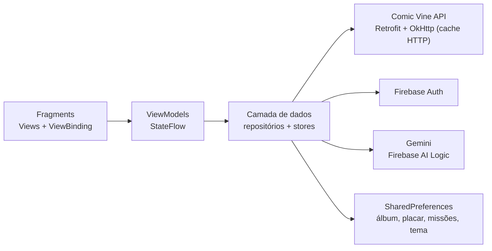

```
app/src/main/java/com/projeto/marvel/
  MainActivity.kt         // hospeda o NavHostFragment e a barra inferior
  data/                   // repositórios, stores, Geek (agente) e progressão
    remote/               // DTOs (Gson), services (Retrofit) e ApiClient
  ui/<feature>/           // um pacote por tela: Fragment, ViewModel e Adapter
```

Regras de dependência: ViewModels só falam com repositórios (nunca com Retrofit); não há framework de DI
(construtor com valor padrão); regras de jogo (batalha, progressão, missões, conquistas) são funções puras
com testes. Detalhes em [`ARCHITECTURE.md`](ARCHITECTURE.md) e [`AGENTS.md`](AGENTS.md).

## Stack

| Área | Tecnologias |
|---|---|
| Linguagem e UI | Kotlin · Views + XML + ViewBinding · Material 3 · Navigation Component |
| Arquitetura | MVVM · Coroutines/Flow (`StateFlow`) |
| Rede e imagens | Retrofit + OkHttp + Gson (com cache HTTP) · Coil |
| Autenticação | Firebase Auth (e-mail/senha e Google via Credential Manager) |
| IA | Firebase AI Logic (Gemini) com function calling · App Check |
| Gráficos | OpenGL ES 2.0 puro (ringue e troféu 3D) |
| Qualidade | JUnit4 + kotlinx-coroutines-test · ktlint · detekt |

## Como rodar

1. Pegue uma API key gratuita em https://comicvine.gamespot.com/api/.
2. Crie/edite `local.properties` na raiz do projeto (não é versionado) e adicione:
   ```
   COMIC_VINE_API_KEY=sua_chave_aqui
   ```
3. Firebase (login e IA), opcional para só compilar e navegar:
   1. No [console do Firebase](https://console.firebase.google.com), crie um projeto e adicione um app
      Android com o pacote `com.projeto.marvel`.
   2. Baixe o `google-services.json` e coloque em `app/` (não é versionado). Sem ele o app compila e
      roda normalmente; o login só mostra "Firebase não configurado".
   3. Em **Authentication → Sign-in method**, ative **E-mail/senha** e **Google**.
   4. Login com Google: rode `./gradlew signingReport`, copie o **SHA1** da variante `debug` e cadastre em
      Configurações do projeto → seu app Android → Adicionar impressão digital. Depois baixe o
      `google-services.json` de novo (o SHA-1 é por máquina).
   5. IA (Geek e "Com qual herói você parece?"): habilite o Firebase AI Logic no projeto. O App Check
      está aplicado: nos builds `debug` o token de depuração aparece no Logcat e precisa ser cadastrado
      no console.
4. Abra o projeto no Android Studio e rode o módulo `app` (minSdk 33).

## Qualidade

```
./gradlew testDebugUnitTest   # testes unitários
./gradlew ktlintCheck         # estilo de código
./gradlew detekt              # code smells
```

## Limitações conhecidas

- A Comic Vine ignora o filtro por editora e a ordenação em `characters/`; listas de personagens e times
  podem trazer itens de fora da Marvel (ver os `TODO` em `ComicVineRepository.kt`).
- A API não tem atributos de combate nem tipos de poder: os da Batalha são **derivados** dos nomes dos
  poderes e do número de aparições (`toFighter()` e `ui/battle/BattleRules.kt`).
- A Comic Vine não separa herói de vilão (o filtro é por origem), não tem coordenadas dos lugares e o
  `release_date` dos filmes é a data de cadastro.
- A Comic Vine limita as requisições (~200/hora por recurso): as chamadas pedem só os campos usados, a
  busca espera parar de digitar e o `ApiClient` guarda cache HTTP (6 h, e serve o que tiver sem rede).
- Progresso (álbum, placar, missões, tema) fica no aparelho, não na conta.

## Créditos e avisos

Projeto educacional feito para o Marvel API Challenge, **sem afiliação com a Marvel**. Marvel e os
personagens são marcas de seus respectivos donos; dados e imagens vêm da
[Comic Vine](https://comicvine.gamespot.com/) e seguem os termos dela. Fontes Bebas Neue, Bangers e Inter
sob licença OFL.
